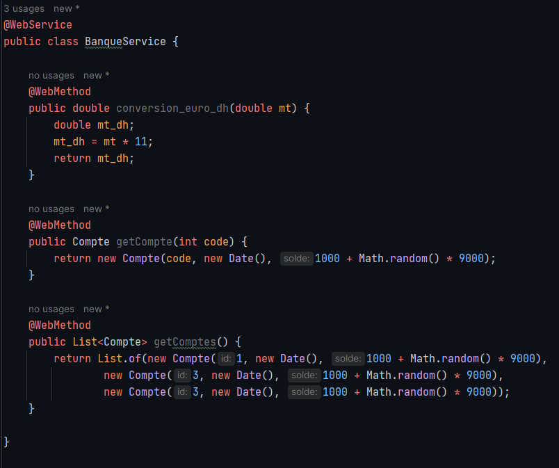

# WebService with JAX_WS

## 1. Créer un Web service qui permet de :

### Convertir un montant de l’auro en DH **

### Consulter un Compte

### Consulter une Liste de comptes

## 2. Déployer le Web service avec un simple Serveur JaxWS

## 3. Consulter et analyser le WSDL avec un Browser HTTP

## 4. Tester les opérations du web service avec un outil comme SoapUI ou Oxygen

### methode conversion :

### methode getCompte :

### methode GetComptes :

## 5. Créer un Client SOAP Java

