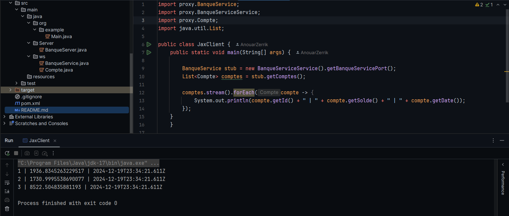

# WebService with JAX_WS

## Table of Contents

1. [Create a Web Service](#1-create-a-web-service)
2. [Deploy the Web Service](#2-deploy-the-web-service)
3. [Analyze the WSDL](#3-analyze-the-wsdl)
4. [Test the Web Service](#4-test-the-web-service)
5. [Create a SOAP Client](#5-create-a-soap-client)

## 1. Create a Web Service

- Convert an amount from Euro to DH
- Consult a single account
- Consult a list of accounts

## 2. Deploy the Web Service

Deploy the Web Service with a simple JaxWS server.

## 3. Analyze the WSDL

Consult and analyze the WSDL with an HTTP browser.

## 4. Test the Web Service

Test the operations of the web service with tools like SoapUI or Oxygen.

### Method: Conversion

### Method: getCompte

### Method: getComptes

## 5. Create a SOAP Client

### Create the Proxy

### Test the Proxy

